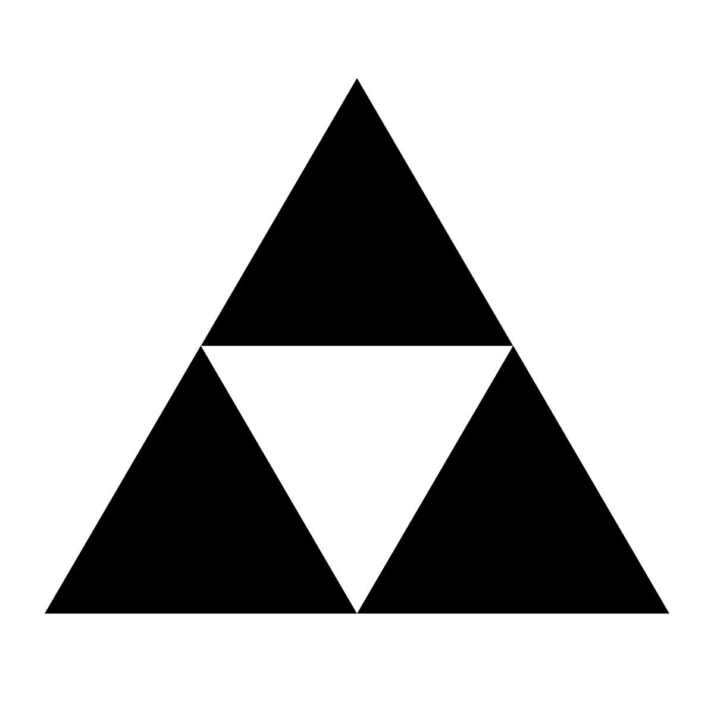

# Hello there! :)

This is a little program to turn any simple black and white image into a nonogram of variable size. 

# How to use

Clone the repository, then run the notebook to check packages that need to be downloaded. 

The fuction has the following args:

### nonogram(route, N, draw_solution)

- **route** [String] is the path of the image to turn into the puzzle
- **N** [int] is the size of the puzzle (NxN square)
- **draw_solution** [bool] makes the program create the empty puzzle if False, and draw the correct solution if True

To change the image, copy it to the folder where the project is located and rename it to "image.jpg", replacing the current one. 

# Example

  

      
      
EXAMPLE IMAGE

      
      
UNSOLVED EXAMPLE NONOGRAM
 
      
      
SOLVED EXAMPLE NONOGRAM
 
  

Hppe you enjoy creating and solving your own puzzles !

PD: interesting read about nonograms: https://web.mat.upc.edu/victor.franco.sanchez/nonograms/
